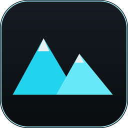
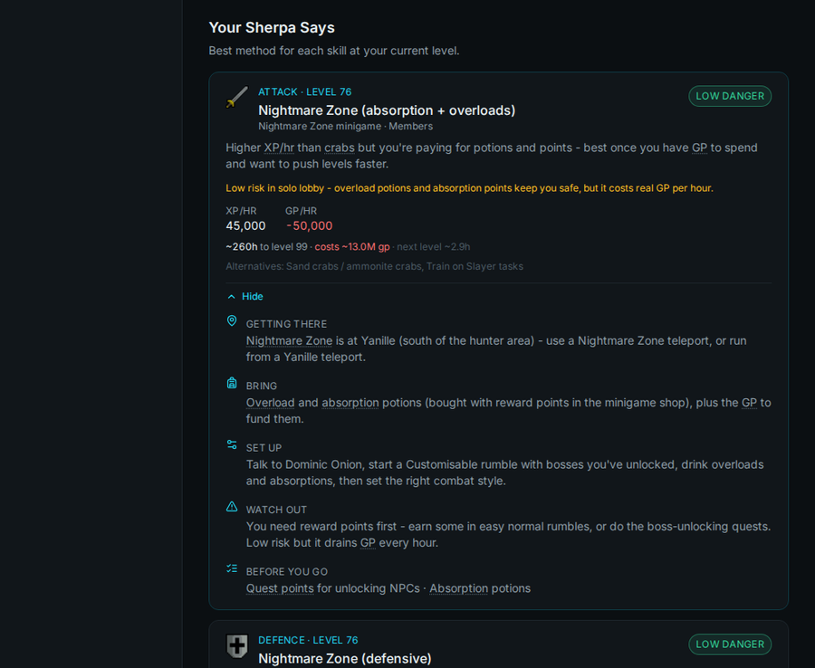
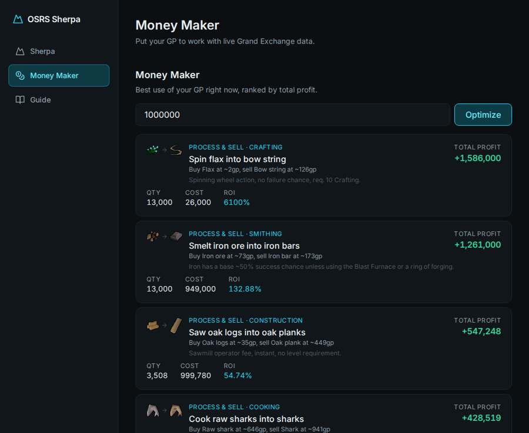
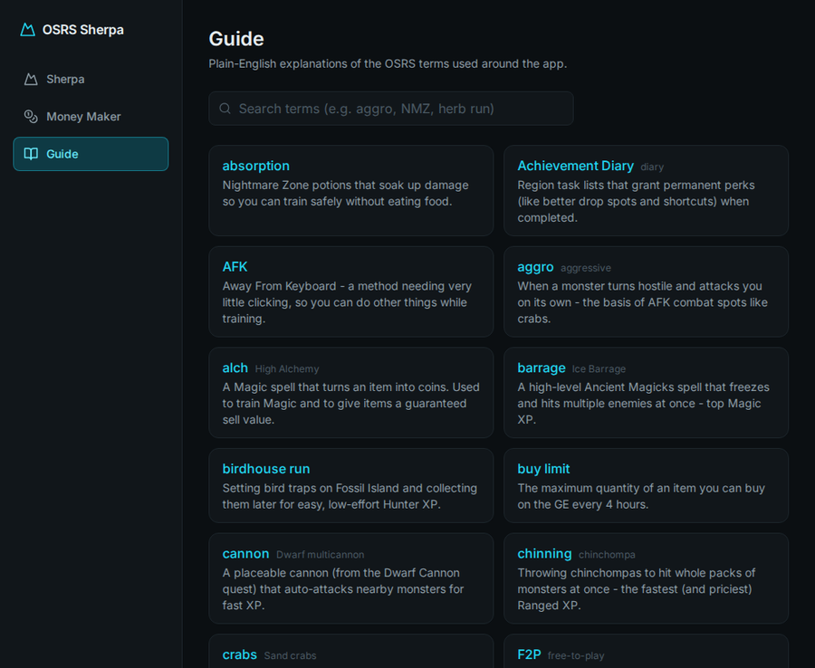

  
  <h1>OSRS Sherpa</h1>
  
<b>Your Old School RuneScape skilling &amp; money-making coach — as a real installable desktop app.</b>

OSRS Sherpa looks up your RuneScape stats and tells you exactly **what to train, how to train it, where to go, and how to make money** — built for players who want a clear plan instead of a dozen open wiki tabs.

---

## ⬇️ Download

➡️ **[Download the latest version](../../releases/latest)** (Windows)

1. Grab `OSRS-Sherpa-Setup-x.x.x.exe` from the latest release.
2. Run it. Windows may show a *"Windows protected your PC"* notice (the app isn't code-signed yet) — click **More info → Run anyway**.
3. After the first install, **the app updates itself** — you'll get an in-app prompt whenever a new version ships. No reinstalling, ever.

---

## ✨ Features

### 🏔️ Sherpa — your training coach
- Enter your RSN and get the **best training method for every skill** at your current level.
- Every method spells out **how to get there, what to bring, how to set it up, and what to watch out for** — written for players who don't know the game inside-out.
- **Time & cost to your goal** at a glance (*"~260h to 99 · costs ~13M gp"*), from live prices.
- A **"What's Next" planner** ranking notable unlocks by how close you are.
- **Quest shortcuts** that skip the early grind.
- A **session journal** that compares your real XP/hr to the estimate.

### 💰 Money Maker
- Enter a GP budget and get the **best ways to use it right now**, ranked by profit.
- **GE flips** and **buy-raw → process → sell** chains, scored on live Grand Exchange prices including the GE tax.
- A live price check for any item.

### 📖 Guide
- A built-in glossary of OSRS jargon, with hover-tooltips throughout the app.
- A free-to-play / members filter so you only see what you can actually do.

---

## 📸 Screenshots

  
   <em>Per-skill coaching with travel directions, cost/time estimates, and jargon tooltips.</em>

  
   <em>Budget-based money-making suggestions from live GE prices.</em>

  
   <em>A plain-English glossary so no term is a mystery.</em>

---

## 🔄 How updates work

The app checks this repository for new releases each time it launches and updates itself in place — no manual downloads after the first install.

## ⚠️ Disclaimer

OSRS Sherpa is an unofficial, fan-made tool and is not affiliated with Jagex. *Old School RuneScape* is a trademark of Jagex Ltd. Item prices and game data are sourced from the [OSRS Wiki](https://oldschool.runescape.wiki) real-time prices API; wiki-derived content is used under [CC BY-SA](https://creativecommons.org/licenses/by-sa/4.0/).
